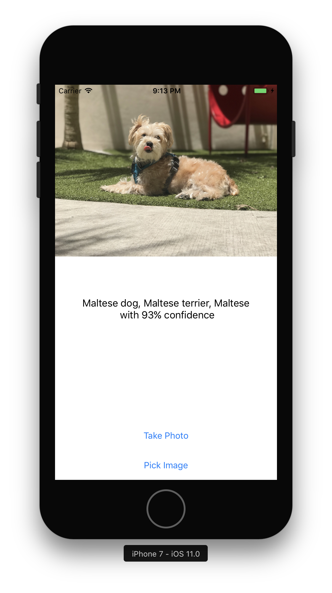
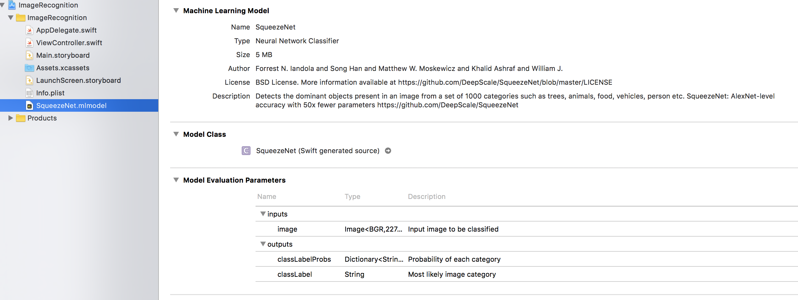

# CoreML Image Recognition

This Swift app demo the use of CoreML models to detect the subject of an image.



## Requirements

* XCode 9.0 beta or +
* A model downloaded from [https://developer.apple.com/machine-learning/](https://developer.apple.com/machine-learning/) or [https://github.com/SwiftBrain/awesome-CoreML-models](https://github.com/SwiftBrain/awesome-CoreML-models)

## Change model

```swift
// ViewController.swift

...

guard let model = try? VNCoreMLModel(for: SqueezeNet().model)

...
```

On line 27, replace `SqueezeNet` by the model class name you wish to use. SqueezeNet is included in this repo because it is small enough.

Class name can be found here:



## Inspiration

I followed this [tutorial video](https://www.youtube.com/watch?v=h2MdQoRMtlQ) in order to build this app.

License
----------------

The MIT License (MIT)

Copyright © 2017 Yalantis

Permission is hereby granted free of charge to any person obtaining a copy of this software and associated documentation files (the "Software") to deal in the Software without restriction, including without limitation the rights to use, copy, modify, merge, publish, distribute, sublicense, and/or sell copies of the Software, and to permit persons to whom the Software is furnished to do so, subject to the following conditions:

The above copyright notice and this permission notice shall be included in all copies or substantial portions of the Software.

THE SOFTWARE IS PROVIDED "AS IS", WITHOUT WARRANTY OF ANY KIND, EXPRESS OR IMPLIED, INCLUDING BUT NOT LIMITED TO THE WARRANTIES OF MERCHANTABILITY,
FITNESS FOR A PARTICULAR PURPOSE AND NONINFRINGEMENT. IN NO EVENT SHALL THE
AUTHORS OR COPYRIGHT HOLDERS BE LIABLE FOR ANY CLAIM, DAMAGES OR OTHER
LIABILITY, WHETHER IN AN ACTION OF CONTRACT, TORT OR OTHERWISE, ARISING FROM,
OUT OF OR IN CONNECTION WITH THE SOFTWARE OR THE USE OR OTHER DEALINGS IN
THE SOFTWARE.
